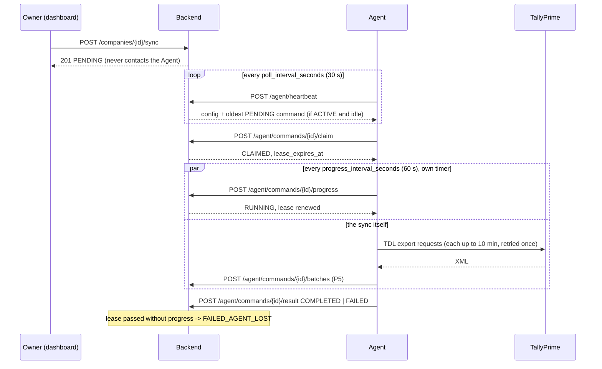

# Agent protocol

How the Sync Agent (P7) talks to the backend. The backend **never** connects to an Agent
(CLAUDE.md rule 12): everything below is the Agent calling the backend over HTTPS with its
bearer credential. Every endpoint below is in the OpenAPI spec (`/openapi.json`, tag
"agent protocol").

## Credentials
- Registration: `POST /agent/register` with the one-time token the Owner/Admin generated
  (`reg_…`, 24 h, single use). The response carries the Agent credential **once**:
  `agt_<agent_id>.<secret>`. Store it; the backend keeps only a salted hash (D-011).
- Every other call: `Authorization: Bearer agt_<agent_id>.<secret>`.
  - `401 CREDENTIAL_INVALID`: wrong, rotated or unknown credential. Stop and ask for the new
    credential (rotation is never pushed to the Agent, SRS 4.4).
  - `401 AGENT_REVOKED`: permanent; the installation must register again as a new Agent.

## Configuration
Registration and every heartbeat return the same `config` object; apply it on every heartbeat
(Owner/Admin changes arrive this way):

| Field | Default | Meaning |
|---|---|---|
| `poll_interval_seconds` | 30 | Heartbeat interval (AGT-1.1) |
| `progress_interval_seconds` | 60 | Progress interval while a command is CLAIMED/RUNNING |
| `command_lease_seconds` | 300 | Lease each progress call renews; at least 3 progress intervals |
| `extraction_batch_size` | 5,000 | Vouchers per Tally request (AGT-4.1; max 10,000) |
| `tally_host`, `tally_port`, `tally_company_name` | localhost, 9000 | Where and which company to target (AGT-5.x) |
| `expected_tdl_version` | backend `MIN_TDL_VERSION` | The TDL package the backend expects |
| `collection_sync_modes` | per gates | `INCREMENTAL` or `FULL_ONLY` per collection (VAL-1.x) |

## Heartbeat — `POST /agent/heartbeat`, every `poll_interval_seconds`
Send versions (VER-1.1), Tally uptime, queue status and Tally status. **Send
`confirmed_tally_guid` whenever Tally can be read**: a REGISTERING or INCOMPATIBLE Agent
becomes ACTIVE only when it matches the registered GUID.

The response gives the Agent's `status`, `config`, `warnings`, and at most one `command`:
- only an **ACTIVE** Agent is given a command (REGISTERING, INCOMPATIBLE: none);
- never while this Agent already has a command CLAIMED or RUNNING (D-035 #13; the database
  enforces one command in progress per Agent);
- the oldest PENDING command not yet past its claim timeout (10 minutes by default).

Offering a command does not assign it: the Agent must claim it (P3.8).

## Progress while a command runs — the lease (D-035 #11)
A claimed command has a lease (`command_lease_seconds`, default 300 s). Each progress call
renews it and also counts as a heartbeat (D-035 #12). If the lease lapses, the command becomes
FAILED_AGENT_LOST and can never be revived or completed (AGT-1.8, AGT-1.9, D-035 #2).

**The Agent must send progress on its own timer, every `progress_interval_seconds`,
independent of any Tally request in flight.** A single Tally export can take up to 10 minutes
and is retried once at half size (AGT-4.3), so one step can take about 20 minutes. Progress
sent only between Tally requests would let the lease lapse and turn a healthy long sync into
FAILED_AGENT_LOST. Run the progress timer on a separate thread/task from the Tally client.

## Commands — claim, progress, result
The heartbeat offers at most one command; the Agent then drives it:

| Call | Allowed when | Effect | Otherwise |
|---|---|---|---|
| `POST /agent/commands/{id}/claim` | Agent ACTIVE; command PENDING and inside its claim window (default 10 min); the Agent has nothing CLAIMED/RUNNING | → CLAIMED, lease = now + `command_lease_seconds` | 409 `INVALID_COMMAND_STATE` (already claimed, expired, one in progress), 409 `AGENT_INCOMPATIBLE`, 404 if not this Agent's command |
| `POST /agent/commands/{id}/progress` | CLAIMED or RUNNING, lease not yet expired | → RUNNING, lease renewed; also counts as a heartbeat | 409 (lease lapsed, finished), 404 |
| `POST /agent/commands/{id}/result` `{status, error_code?, error_message?}` | COMPLETED: RUNNING. FAILED (needs `error_code`): CLAIMED or RUNNING. Lease not expired | → COMPLETED / FAILED | 409, 404, 422 |

Each call is one conditional `UPDATE` on the command row (AGT-1.3), so a duplicate or late call
can never change a finished command. A 409 means "stop working on this command"; do not retry it.

| State | Set by | Final |
|---|---|---|
| PENDING | Sync Now or a schedule | |
| CLAIMED | claim | |
| RUNNING | first progress | |
| COMPLETED / FAILED | result | yes |
| EXPIRED | backend job: not claimed within the claim window (AGT-1.10) | yes |
| FAILED_AGENT_LOST | backend job: lease passed (AGT-1.8); reason in `error_message` | yes |

A failed, expired or lost command is never retried or reassigned (AGT-1.4, AGT-1.9): an
Owner/Admin issues a new command, to this Agent or a standby.

