# Database schema

Generated from `backend/app/models` (Phase 1). One migration creates it:
`backend/alembic/versions/0001_initial_schema.py`. SRS Section 5 is the source; additions come
from `docs/decisions.md` (D-001, D-003, D-004, D-010, D-011, D-022, D-024, D-025, D-031).

## Invariants the database enforces

| Invariant | How | Requirement |
|---|---|---|
| A synced master or voucher is unique per company by GUID | `UNIQUE(company_id, tally_guid)` on the 6 synced tables | DR-4.1, 4.2, 4.4, 4.6 |
| A row never references another company's row | Every company-scoped reference is a composite FK `(company_id, x_id)` | SEC-1.7, D-031 |
| Masters and vouchers are never hard-deleted | `forbid_delete` trigger (BEFORE DELETE) on groups, ledgers, voucher_types, stock_items, cost_centres, vouchers | 5.1-5, DR-ML-1 |
| Child rows can be replaced | No trigger on children; child FKs `ON DELETE CASCADE` | 6.9, DR-VE-3/4 |
| Normalized amounts are consistent | CHECKs: `amount_absolute >= 0`; `amount_signed = ±amount_absolute` by direction; `is_debit = (direction = 'DEBIT')` | 5.8, ACC-DATA-1 |
| Enum and status columns hold known values | `text` + CHECK generated from `app/models/enums.py` | P1.1 |
| A command's Agent never changes | `agent_commands.agent_id NOT NULL` + `agent_commands_immutable_owner` trigger | RTE-1.4 |
| DATE_RANGE commands have ordered dates | `ck_agent_commands_date_range` | D-031 |
| A RESOLVED group has an anchor and a nature | `ck_groups_resolved_has_anchor` | D-001 |
| An allow-list entry resolves in one join | partial `UNIQUE(company_id, reserved_name)` on groups | D-001 |
| The audit log is append-only | `tally_app` has INSERT/SELECT only; `audit_logs_append_only` trigger blocks UPDATE/DELETE for every role | SEC-1.13 |
| The app role cannot change the schema | `tally_app` has DML only (`deploy/postgres/grants.sql`) | SEC-1.15 |

Money is `NUMERIC(20,4)`, quantity and rate `NUMERIC(20,6)`; timestamps are `timestamptz`;
`voucher_date` and other business dates are `date` (D-010, D-020). Convention tests in
`backend/tests/models/test_conventions.py` keep every new table to these rules.

Allow-list defaults (SRS 18.2) are not rows: they live in `app/models/defaults.py` and
`company_settings` stores overrides only (D-031).

## Entity-relationship diagram

For readability the direct `company_id` link is drawn only where a table has no composite FK
that already implies it.

```mermaid
erDiagram
    companies {
        uuid company_id PK
        text tally_guid
        text name
        date financial_year_start
        text company_timezone
        bool is_active
        timestamptz created_at
    }
    roles {
        smallint role_id PK
        text role_name
    }
    users {
        uuid user_id PK
        text email
        text password_hash
        text name
        bool is_active
        timestamptz created_at
    }
    agent_registration_tokens {
        uuid token_id PK
        uuid company_id FK
        text token_hash
        timestamptz expires_at
        timestamptz used_at
        uuid created_by FK
    }
    agents {
        uuid agent_id PK
        uuid company_id FK
        text agent_name
        text credential_hash
        bytea credential_salt
        text status
        text tally_guid
        text tally_company_name
        text tally_host
        int tally_port
        int extraction_batch_size
        text agent_version
        text tdl_version
        text tally_version
        bigint tally_uptime_seconds
        jsonb queue_status
        timestamptz last_heartbeat_at
        timestamptz registered_at
        timestamptz revoked_at
        text last_tally_status
        timestamptz tally_status_since
    }
    ai_tool_log {
        bigint id PK
        uuid company_id FK
        text tool_name
        jsonb parameters
        text result_summary
        text status
        timestamptz created_at
    }
    audit_logs {
        bigint id PK
        uuid company_id FK
        uuid user_id FK
        text action
        text entity_type
        text entity_id
        jsonb before_value
        jsonb after_value
        jsonb data_range
        text result
        timestamptz created_at
    }
    company_settings {
        uuid company_id PK,FK
        text setting_key PK
        jsonb setting_value
        text data_type
        uuid updated_by FK
        timestamptz updated_at
    }
    cost_centres {
        uuid cost_centre_id PK
        text status
        text name
        uuid company_id FK
        text tally_guid
        bigint alter_id
        timestamptz last_synced_at
    }
    custom_field_mappings {
        uuid mapping_id PK
        uuid company_id FK
        text collection_type
        text tally_field
        text field_key
        text data_type
        bool is_active
        uuid updated_by FK
        timestamptz updated_at
    }
    feature_config {
        uuid company_id PK,FK
        text feature_name PK
        bool enabled
        uuid updated_by FK
        timestamptz updated_at
    }
    groups {
        uuid group_id PK
        text status
        text name
        uuid parent_group_id FK
        text parent_tally_guid
        uuid predefined_group_id FK
        uuid classification_group_id FK
        uuid primary_group_id FK
        text nature
        bool is_predefined
        text reserved_name
        text resolution_status
        uuid company_id FK
        text tally_guid
        bigint alter_id
        timestamptz last_synced_at
    }
    reconciliation_results {
        bigint id PK
        uuid company_id FK
        timestamptz run_at
        text metric
        uuid entity_id
        date period_start
        date period_end
        numeric_20_4 tally_value
        numeric_20_4 local_value
        numeric_20_4 absolute_difference
        numeric_20_6 percentage_difference
        text result
    }
    stock_items {
        uuid stock_item_id PK
        text status
        text name
        text base_unit
        numeric_20_6 gst_rate
        jsonb custom_fields
        uuid company_id FK
        text tally_guid
        bigint alter_id
        timestamptz last_synced_at
    }
    user_roles {
        uuid user_id PK,FK
        uuid company_id PK,FK
        smallint role_id PK,FK
    }
    voucher_types {
        uuid voucher_type_id PK
        text status
        text name
        uuid parent_voucher_type_id FK
        text parent_tally_guid
        text reserved_name
        text base_voucher_type
        text resolution_status
        uuid company_id FK
        text tally_guid
        bigint alter_id
        timestamptz last_synced_at
    }
    agent_commands {
        uuid command_id PK
        uuid company_id FK
        uuid agent_id FK
        text command_type
        text sync_mode
        date date_from
        date date_to
        text status
        timestamptz lease_expires_at
        uuid created_by FK
        timestamptz created_at
        timestamptz claimed_at
        timestamptz completed_at
        text error_message
    }
    ledgers {
        uuid ledger_id PK
        text status
        text name
        uuid group_id FK
        text parent_group_tally_guid
        uuid primary_group_id FK
        uuid predefined_group_id FK
        uuid classification_group_id FK
        bool is_bill_wise
        jsonb custom_fields
        uuid company_id FK
        text tally_guid
        bigint alter_id
        timestamptz last_synced_at
    }
    stock_opening_balances {
        uuid company_id FK
        uuid stock_item_id PK,FK
        date financial_year_start PK
        numeric_20_6 quantity
        text unit
        numeric_20_4 value
    }
    sync_schedules {
        uuid schedule_id PK
        uuid company_id FK
        uuid agent_id FK
        text cron_expression
        text sync_mode
        bool is_active
        uuid created_by FK
    }
    sync_watermarks {
        uuid company_id PK
        text collection_type PK
        bigint last_alter_id
        timestamptz last_successful_sync_at
        text status
        uuid locked_by_agent_id FK
        timestamptz lock_acquired_at
        timestamptz lock_expires_at
    }
    vouchers {
        uuid voucher_id PK
        text status
        text voucher_number
        uuid voucher_type_id FK
        date voucher_date
        text narration
        jsonb custom_fields
        uuid company_id FK
        text tally_guid
        bigint alter_id
        timestamptz last_synced_at
    }
    anomaly_flags {
        bigint id PK
        uuid company_id
        uuid voucher_id FK
        text rule_triggered
        numeric_20_4 transaction_amount
        numeric_20_4 historical_average
        numeric_20_4 historical_max
        numeric_20_6 deviation_percent
        uuid duplicate_of_voucher_id FK
        timestamptz flagged_at
        text explanation_text
        text explanation_status
        bool reviewed
        bool not_an_issue
        uuid reviewed_by FK
        timestamptz reviewed_at
    }
    ledger_opening_balances {
        uuid company_id FK
        uuid ledger_id PK,FK
        date financial_year_start PK
        numeric_20_4 amount_absolute
        text accounting_direction
    }
    opening_bill_allocations {
        bigint id PK
        uuid company_id FK
        uuid ledger_id FK
        text reference_name
        date bill_date
        date due_date
        numeric_20_4 amount_absolute
        text accounting_direction
        date financial_year_start
    }
    sync_runs {
        uuid sync_run_id PK
        uuid company_id
        uuid agent_id FK
        uuid command_id FK
        text sync_mode
        timestamptz started_at
        timestamptz ended_at
        text status
        int records_fetched
        int records_failed
    }
    voucher_entries {
        bigint voucher_entry_id PK
        uuid company_id
        uuid voucher_id FK
        uuid ledger_id FK
        int line_sequence
        text stable_line_id
        text amount_raw
        bool is_debit
        numeric_20_4 amount_absolute
        numeric_20_4 amount_signed
        text accounting_direction
    }
    voucher_items {
        bigint id PK
        uuid company_id
        uuid voucher_id FK
        uuid stock_item_id FK
        numeric_20_6 quantity
        text unit
        numeric_20_6 rate
        numeric_20_4 amount
        jsonb custom_fields
    }
    bill_allocations {
        bigint id PK
        uuid company_id
        bigint voucher_entry_id FK
        uuid ledger_id FK
        text allocation_type_raw
        text allocation_type
        text reference_name
        date due_date
        numeric_20_4 amount_absolute
        text accounting_direction
    }
    cost_centre_allocations {
        bigint id PK
        uuid company_id
        bigint voucher_entry_id FK
        uuid cost_centre_id FK
        numeric_20_4 amount_absolute
    }
    stock_snapshots {
        uuid company_id FK
        uuid stock_item_id PK,FK
        date as_of_date PK
        numeric_20_6 closing_quantity
        text unit
        uuid sync_run_id FK
    }
    sync_batches {
        uuid batch_id PK
        uuid company_id
        uuid sync_run_id FK
        text collection_type
        int batch_seq
        timestamptz committed_at
        int accepted
        int rejected_stale
        int error_count
    }
    sync_errors {
        bigint id PK
        uuid company_id
        uuid sync_run_id FK
        text entity_type
        text tally_guid
        text error_code
        text message
        timestamptz created_at
    }
    agent_commands ||--o{ sync_runs : "command_id"
    agents ||--o{ agent_commands : "agent_id"
    agents ||--o{ sync_runs : "agent_id"
    agents ||--o{ sync_schedules : "agent_id"
    agents ||--o{ sync_watermarks : "locked_by_agent_id"
    companies ||--o{ agent_registration_tokens : "company_id"
    companies ||--o{ agents : "company_id"
    companies ||--o{ ai_tool_log : "company_id"
    companies ||--o{ audit_logs : "company_id"
    companies ||--o{ company_settings : "company_id"
    companies ||--o{ cost_centres : "company_id"
    companies ||--o{ custom_field_mappings : "company_id"
    companies ||--o{ feature_config : "company_id"
    companies ||--o{ groups : "company_id"
    companies ||--o{ ledgers : "company_id"
    companies ||--o{ reconciliation_results : "company_id"
    companies ||--o{ stock_items : "company_id"
    companies ||--o{ user_roles : "company_id"
    companies ||--o{ voucher_types : "company_id"
    companies ||--o{ vouchers : "company_id"
    cost_centres ||--o{ cost_centre_allocations : "cost_centre_id"
    groups ||--o{ groups : "classification_group_id"
    groups ||--o{ groups : "parent_group_id"
    groups ||--o{ groups : "predefined_group_id"
    groups ||--o{ groups : "primary_group_id"
    groups ||--o{ ledgers : "classification_group_id"
    groups ||--o{ ledgers : "group_id"
    groups ||--o{ ledgers : "predefined_group_id"
    groups ||--o{ ledgers : "primary_group_id"
    ledgers ||--o{ bill_allocations : "ledger_id"
    ledgers ||--o{ ledger_opening_balances : "ledger_id"
    ledgers ||--o{ opening_bill_allocations : "ledger_id"
    ledgers ||--o{ voucher_entries : "ledger_id"
    roles ||--o{ user_roles : "role_id"
    stock_items ||--o{ stock_opening_balances : "stock_item_id"
    stock_items ||--o{ stock_snapshots : "stock_item_id"
    stock_items ||--o{ voucher_items : "stock_item_id"
    sync_runs ||--o{ stock_snapshots : "sync_run_id"
    sync_runs ||--o{ sync_batches : "sync_run_id"
    sync_runs ||--o{ sync_errors : "sync_run_id"
    users ||--o{ agent_commands : "created_by"
    users ||--o{ agent_registration_tokens : "created_by"
    users ||--o{ anomaly_flags : "reviewed_by"
    users ||--o{ audit_logs : "user_id"
    users ||--o{ company_settings : "updated_by"
    users ||--o{ custom_field_mappings : "updated_by"
    users ||--o{ feature_config : "updated_by"
    users ||--o{ sync_schedules : "created_by"
    users ||--o{ user_roles : "user_id"
    voucher_entries ||--o{ bill_allocations : "voucher_entry_id"
    voucher_entries ||--o{ cost_centre_allocations : "voucher_entry_id"
    voucher_types ||--o{ voucher_types : "parent_voucher_type_id"
    voucher_types ||--o{ vouchers : "voucher_type_id"
    vouchers ||--o{ anomaly_flags : "duplicate_of_voucher_id"
    vouchers ||--o{ anomaly_flags : "voucher_id"
    vouchers ||--o{ voucher_entries : "voucher_id"
    vouchers ||--o{ voucher_items : "voucher_id"
```

